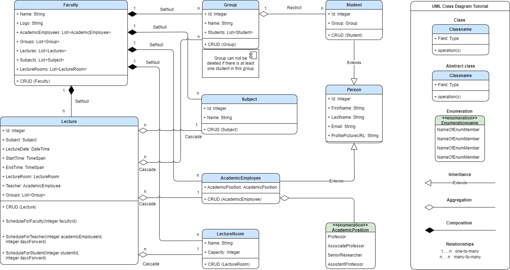

# University Management System

University Management System is an ASP.NET Core application that aims to provide a comprehensive management solution for educational institutions. It is built using .NET Core & ASP.NET Core & EF Core technologies.

## Technologies

- .NET Core 7.x
- ASP.NET Core 7.x
- Entity Framework Core 7.x
- Microsoft SQL Server
- Bootstrap 5.x
- jQuery 3.x
- Moq 4.x
- xUnit 2.x

## Schema of Project

Here is a UML class diagram representing the schema of the University Management System application:

## Architecture

The University Management System implements a [traditional "N-Layer" architecture](https://learn.microsoft.com/en-us/dotnet/architecture/modern-web-apps-azure/common-web-application-architectures#traditional-n-layer-architecture-applications).

Using this architecture, users make requests through the UI (User Interface) layer, which interacts only with the BLL (Buisness Logic layer). The BLL, in turn, can call the DAL (Data Access layer) for data access requests. The UI layer shouldn't make any requests to the DAL directly, nor should it interact with persistence directly through other means. Likewise, the BLL should only interact with persistence by going through the DAL. In this way, each layer has its own well-known responsibility.

The application adopts the [Repository-Service pattern](https://exceptionnotfound.net/the-repository-service-pattern-with-dependency-injection-and-asp-net-core/), which promotes a clear separation between data access and business logic.

The project utilizes a generic repository pattern to provide a common interface for data access operations. The generic repository simplifies the implementation of data access code and allows for flexibility when working with different entities.

## Structure of Project

The project is structured into three main layers:

1. Core:
   - Entities: Contains business model classes that are persisted
   - Interfaces: Defines interfaces used by other layers
   - Domain Services: Implements business logic and rules
   - Models: Provides data models for views
   - Attributes: Contains custom attributes for data validation and other purposes

2. Infrastructure:
   - EF Core types: Includes the DbContext and migration configurations
   - Data access implementation types: Contains repositories for data access

3. Web:
   - Controllers: Handles the application's HTTP requests and responses
   - Views: Renders the UI and interacts with users
   - ViewModels: Strongly Typed ViewModels used to pass data from controller action method to view
   - Program.cs: Contains the entry point of the application

## Features

- CRUD operations for faculties, teachers, groups, students, lectures etc.
- Dependent dropdowns: The application includes functionality for dynamic dropdowns that update based on user selections, providing an intuitive user experience.
- Schedules: The system supports schedules for faculties, students, and teachers, allowing them to view and their respective schedules.
- Group deletion constraint: A group cannot be deleted if there is at least one student assigned to that group, ensuring data integrity and preventing accidental deletions.
- Sorting: Implemented sorting functionality to allow users to sort data in ascending or descending order based on different columns.
- Searching: Implemented searching functionality to enable users to search for specific records using keywords or filters.
- Pagination: Utilizes the X.PagedList library to implement pagination, breaking down large datasets into smaller, manageable pages for improved user experience.

## Responsive Design

The University Management System features a responsive design that adapts to various screen sizes and devices. Whether accessed from a desktop computer, tablet, or smartphone, the application's UI will adjust to provide an optimal viewing experience.

## Installation

To run the University Management System locally, please follow these steps:

1. Clone the repository to your local machine.
2. Open the solution in your preferred development environment.
3. Build and run the application.

## Contributing

Contributions to the University Management System are welcome! If you have any suggestions, bug reports, or feature requests, please open an issue or submit a pull request following the project's guidelines.

## License

This project is licensed under the [MIT License](LICENSE.txt).

## Screenshots

